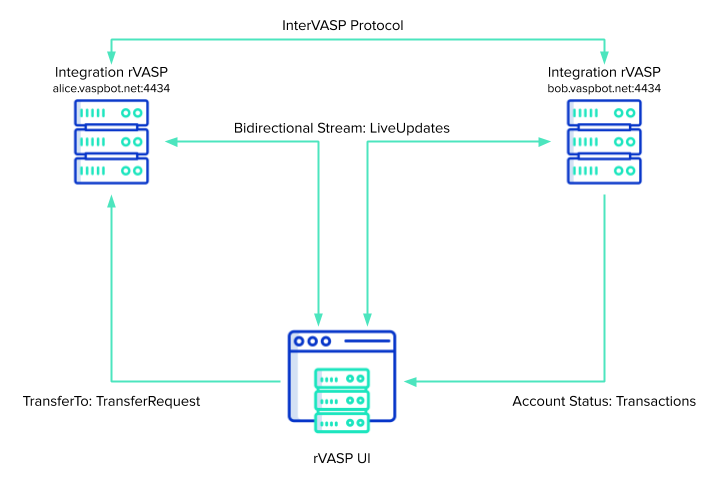

# rVASP

**Robot VASP for TRISA demonstration and integration**

This is a simple gRPC server that implements a UI workflow and messaging framework to demonstrate sending and receiving transactions using the TRISA InterVASP protocol. The server was built to support a demonstration UI that requires a streaming interface so that a live message flow is achieved. However, the communication protocol between rVASPs also demonstrates how implementers might go about writing InterVASP services in their own codebases. The architecture is as follows:



## Generating Protocol Buffers

To regenerate the Go and Python code from the protocol buffers:

```
$ go generate ./...
```

This will generate the Go code in `pb/` and the Python code in `pb/rvaspy`. Alternatively you can manually generate the code to specify different directories using the following commands:

```
$ protoc -I . --go_out=plugins=grpc:. api.proto
$ python -m grpc_tools.protoc -I . --python_out=./rvaspy --grpc_python_out=./rvaspy api.proto
```

## Quick Start

To get started using the rVASP, you can run the local server as follows:

```
$ go run ./cmd/rvasp serve
```

The server should now be listening for TRISADemo RPC messages. To send messages using the python API, make sure you can import the modules from `pb/rvaspy` and run the following script:

```python
from rvaspy.client import RVASP

api = RVASP("rvaspy", "localhost:4434")

cmds = [
    api.account_request("robert@bobvasp.co.uk"),
    api.transfer_request("robert@bobvasp.co.uk", "mary@alicevasp.us", 42.99)
]

for msg in api.stub.LiveUpdates(iter(cmds)):
    print(msg)
```

Note that the `RVASP` api client is not fully implemented yet.

## Containers

We are currently not using a container repository, so to build the docker images locally, please run the following steps in order:

1. Build the root Docker image tagged as `trisacrypto/rvasp:latest`
2. Build the alice, bob, and evil containers in `containers/`, tagging them appropriately
3. Use `docker-compose` to run the three rVASPs locally

To simplify the build process, we have added a script that builds all 4 images. You can execute the building script as follows:

```
$ ./containers/rebuild.sh
```

Then all that's needed is to run `docker-compose up` to get the robot VASPs running locally.
